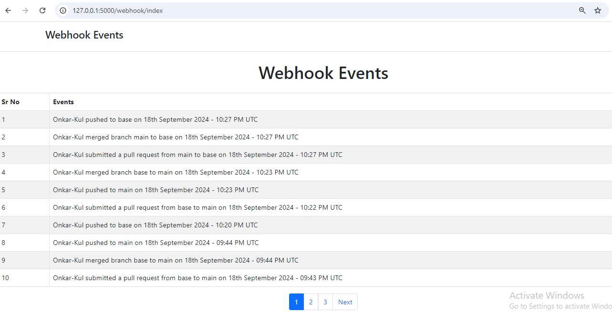

# 🌐 Webhook Event Tracker

Welcome to the **Webhook Event Tracker**! This project allows you to track GitHub events (push, pull request, and merge) in real-time using webhooks, with the data stored in MongoDB and displayed on a user-friendly interface. The application supports pagination and real-time updates every 15 seconds.


---

## ✨ Features

- 🔔 **Real-time tracking** of GitHub events (push, pull request, merge) via webhooks
- 📊 **Pagination support** to navigate through events
- ⏳ **Auto-refresh** every 15 seconds to update event data
- 🗂 **MongoDB storage** for persisting event data
- 🌐 **Responsive UI** built with **Bootstrap** and **Flask**

---

## 🚀 Quick Start
Follow the steps below to get the project running on your local machine.


## 🔧 Installation
Make sure you have Python 3.x installed. Clone the repository and navigate to the project directory. Install the required dependencies using the `requirements.txt` file.
1. **Clone the Repository**
   ```bash
   git clone https://github.com/Onkar-Kul/webhook-repo.git

2. **Create Virtual Environment**
   ```bash
    python -m venv venv
    source venv/bin/activate  
    # On Windows: venv\Scripts\activate

3. **Install all dependencies**
   ```bash
   pip install -r requirements.txt

## ⚙️ Set Up MongoDB
Make sure MongoDB is installed and running on your machine or use MongoDB Atlas (cloud database).

* Set the MongoDB URI in the Flask app as 
    ```bash
    mongodb://localhost:27017/ or your remote MongoDB URI.

## 🔧 Configure Webhook on GitHub
To receive GitHub events, you need to configure a Webhook on your GitHub repository:

1. Go to your GitHub repository settings.
2. Select Webhooks → Add Webhook.

3. Setup ngrok to sent the payload securely on your local machine

4. Set the Payload URL to http://your_ngork_address/webhook.
5. Choose application/json as the Content Type.
6. Select events to trigger the webhook (e.g., push, pull request, merge).
7. Add webhook

##  🚀 Run the Application
* Now, you’re ready to start the Flask app:
    ```bash
        # Run the Flask app
        flask run
* or 
    ```bash
        python run.py

* Then Visit the app in your browser at: 
    ```bash
    http://localhost:5000

## 🛠️ Project Structure
* The Project structure as follows:
    ```bash
    webhook-repo/
    ├── app/
    │   ├── webhook/
    │   │   ├── __init__.py        # Initializes the app
    │   │   ├── routes.py          # Routes for webhook and index
    │   ├── __init__.py            # App factory and custom filters
    │   ├── extensions.py          # Mongodb configuration
    ├── templates/
    │   ├── index.html             # Main HTML page with Bootstrap and pulling javaScript
    ├── .gitignore                 # Files to ignore in GitHub
    ├── README.md                  # You are reading it now!
    ├── requirements.txt           # Python dependencies
    ├── run.py                     # Entry point for running the app

## 🔄 Webhook Event Flow
1. GitHub Action: A GitHub action (push, pull request, or merge) occurs.
2. Webhook Trigger: The webhook sends event data to the registered endpoint (/webhook).
3. Store in MongoDB: The event data is stored in MongoDB.
4. Real-time Display: The event is displayed in the front-end UI with pagination and auto-refresh.  

## 📚 API Endpoints

| Method |    Endpoint    |                                 Description                                 |
|:------:|:--------------:|:---------------------------------------------------------------------------:|
|  GET   | /webhook/index | Displays the home page with events and	Fetches paginated event data as JSON |
|  POST  |    /webhook    |            Receives GitHub webhook data and stores it in mongodb            |


## 🖼️ Screenshots

UI of the Webhook Event Tracker with event history and real-time updates



## 🤝 Acknowledgements
* Flask - Micro web framework for Python
* MongoDB - Database for storing event data
* Bootstrap - CSS framework for responsive UI

## 👨‍💻 Author: Onkar Kulkarni

### Explanation of Sections:

1. **Badges**: Added badges to represent key technologies (GitHub, MongoDB, Flask, Bootstrap) and give the README a nice look.
2. **Quick Start**: Step-by-step instructions to clone the repository, install dependencies, set up MongoDB, and configure the webhook.
3. **Project Structure**: Overview of the project files for easy navigation.
4. **Webhook Event Flow**: A simple explanation of how the webhook integration works from GitHub to MongoDB and the UI.
5. **API Endpoints**: Clear documentation of the API routes for the project.
6. **Screenshots**: Placeholder for a screenshot to showcase the UI.

